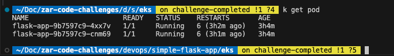
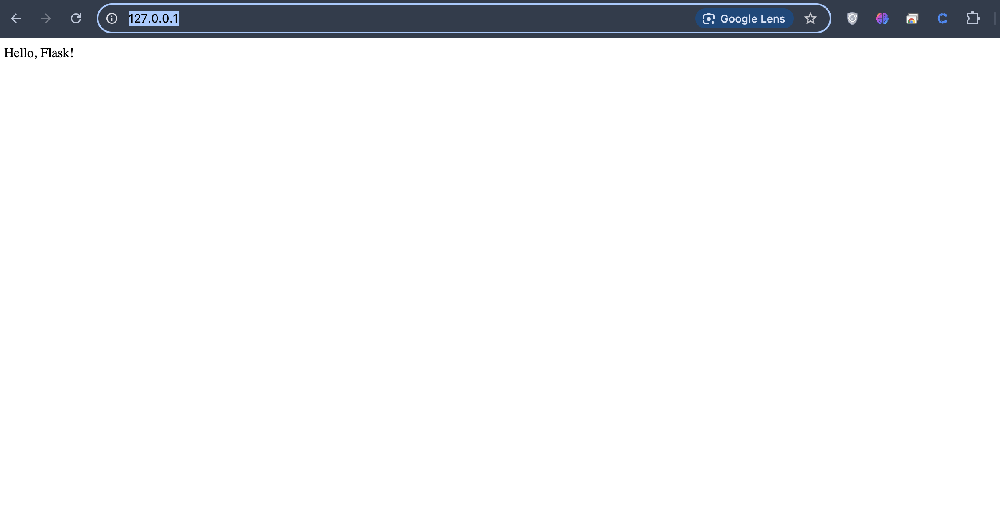

# Flask App DevOps Solution

This repository contains a Flask application deployed using modern DevOps practices, including Infrastructure as Code (IaC), containerization, CI/CD automation, and Kubernetes deployment on AWS.

---

## 🧱 Architecture Overview

This solution implements the following architecture:

> **📷 *Architecture Diagram Placeholder***
> *\[Insert your image or link here]*

* **Application:** Python Flask web app containerized using Docker
* **Infrastructure:** AWS EKS (Elastic Kubernetes Service) provisioned via Terraform
* **CI/CD:** GitHub Actions for continuous integration and deployment
* **Container Registry:** AWS ECR for storing Docker images
* **Networking:** AWS VPC with public and private subnets, exposed via Load Balancer

---

## 📁 Directory Structure

```bash
simple-flask-app/
├── app.py                    # Flask application
├── example.db                # SQLite database
├── requirements.txt          # Python dependencies
├── Dockerfile                # Docker container definition
├── .github/
│   └── workflows/
│       └── ci-cd.yml         # GitHub Actions workflow
├── terraform/                # Infrastructure as Code (IaC)
│   ├── main.tf               # Main Terraform configuration
│   ├── variables.tf          # Variable definitions
│   ├── outputs.tf            # Output values
│   └── providers.tf          # Provider configuration
└── kubernetes/               # Kubernetes manifests
    ├── deployment.yaml       # App deployment definition
    ├── service.yaml          # Service to expose the app
    └── configmap.yaml        # Externalized configuration
```

---

## 🧰 Prerequisites

* AWS account with administrative access
* AWS CLI installed and configured
* Terraform (v1.0+) installed
* `kubectl` installed
* Docker installed
* GitHub account

---

## 🚀 Deployment Instructions

### Step 1: Clone the Repository

```bash
git clone https://github.com/zarpay/zar-code-challenges.git
cd zar-code-challenges
```

### Step 2: Set Up GitHub Secrets

Add the following secrets to your GitHub repository:

* `AWS_ACCESS_KEY_ID`: Your AWS access key
* `AWS_SECRET_ACCESS_KEY`: Your AWS secret key

### Step 3: Provision Infrastructure with Terraform

```bash
cd terraform
terraform init
terraform plan
terraform apply
```

This will create:

* A VPC with public and private subnets
* An EKS cluster
* An ECR repository for the Docker image

Take note of the Terraform outputs, especially the ECR repository URL and the `kubectl` configuration command.

### Step 4: Configure `kubectl`

```bash
aws eks update-kubeconfig --region us-west-2 --name flask-app-cluster
```

### Step 5: Manual Deployment (First Time Only)

#### Build and Push the Docker Image

```bash
cd ../simple-flask-app
docker build -t flask-app .
aws ecr get-login-password --region us-west-2 | docker login --username AWS --password-stdin <your-account-id>.dkr.ecr.us-west-2.amazonaws.com
docker tag flask-app:latest <your-account-id>.dkr.ecr.us-west-2.amazonaws.com/flask-app:latest
docker push <your-account-id>.dkr.ecr.us-west-2.amazonaws.com/flask-app:latest
```

#### Deploy to Kubernetes

```bash
cd ../kubernetes
# Replace placeholder in deployment.yaml
export ECR_REPOSITORY_URL=<your-account-id>.dkr.ecr.us-west-2.amazonaws.com/flask-app
envsubst < deployment.yaml > deployment-updated.yaml

kubectl apply -f configmap.yaml
kubectl apply -f deployment-updated.yaml
kubectl apply -f service.yaml
```

### Step 6: Automated CI/CD

For future updates, simply push changes to the `main` branch:

```bash
git add .
git commit -m "Update application"
git push origin main
```

The GitHub Actions workflow will automatically:

* Build a new Docker image
* Push it to ECR
* Deploy it to the EKS cluster

### Step 7: Access the Application

Get the load balancer URL:

```bash
kubectl get service flask-app
```

The service will be accessible via the `EXTERNAL-IP` on port `80`.

---

## 🧹 Cleanup

To avoid unnecessary AWS charges, destroy the infrastructure when no longer needed:

```bash
cd terraform
terraform destroy
```

---

## 🔧 Architecture Decisions

### Containerization

* Docker used to encapsulate app and dependencies
* Lightweight Python base image for performance and smaller size

### Infrastructure as Code

* Terraform ensures reproducibility and modularity
* AWS EKS (managed service) used to minimize operational overhead

### Kubernetes Configuration

* Multiple replicas for high availability
* Health checks for reliability
* ConfigMap used for environment configuration
* Resource limits defined to avoid overutilization

### CI/CD Pipeline

* GitHub Actions automates build → test → deploy
* Docker images tagged with `latest` and commit SHA
* Progressive delivery strategy used

---

## 📈 Future Improvements

* Add monitoring/logging (e.g., Prometheus, Grafana, ELK stack)
* Implement blue/green or canary deployments
* Add automated testing to CI/CD pipeline
* Replace SQLite with a managed, persistent database
* Integrate a secrets manager (e.g., AWS Secrets Manager)

---

## 🧪 Minikube Testing Note

We also tested this application locally on **Minikube**.

### Differences in Minikube:

* Minikube doesn’t support `LoadBalancer` services by default.
* Therefore, `service.yaml` excludes AWS-specific annotations.

To run it locally:

#### Use a local Docker image:

```bash
eval $(minikube -p minikube docker-env)
docker build -t flask-app:latest .
```

Update `deployment.yaml` to use the `flask-app:latest` image locally.

> ✅ The Flask app successfully ran in the local Minikube environment.
> 📸 \[Attach your snapshot screenshot here]


